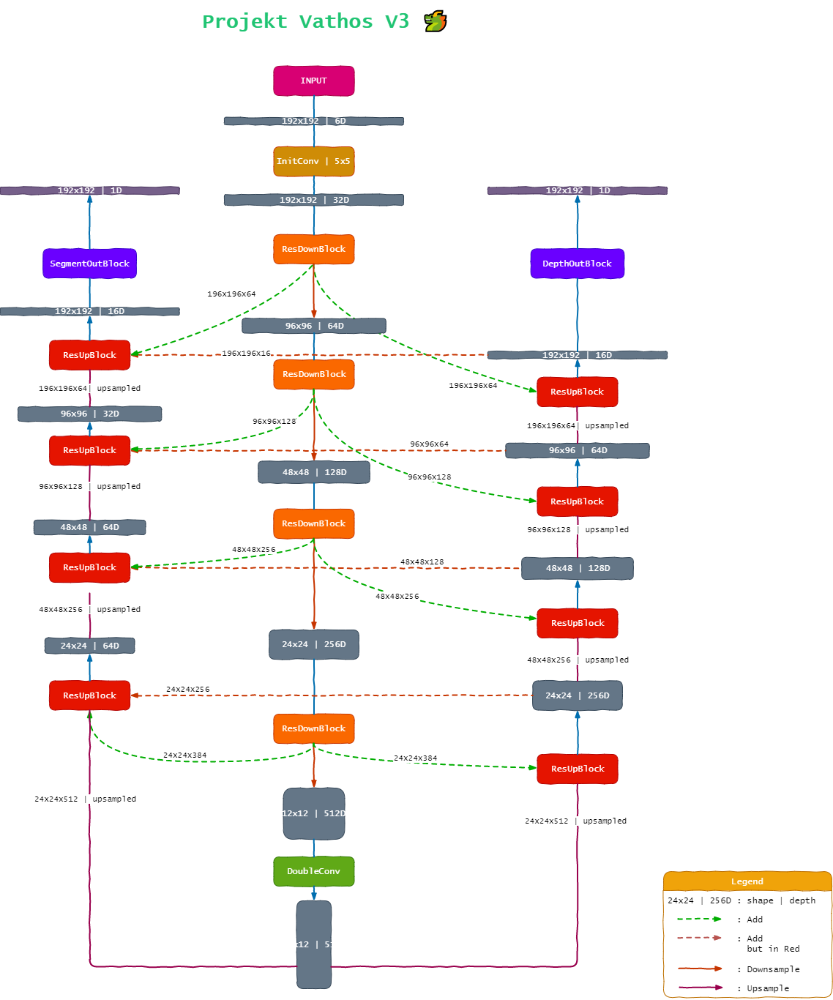

<h1 align="center">ProjektDepth - váthos 🐲</h1>


<div align="center">

</div>

---

# Documentation 📚

## https://projektdepth.readthedocs.io/en/latest/

# Status


[](https://projektdepth.readthedocs.io/en/latest/)


# Config File

```yaml
name: vathos_small_train
log_dir: logs
chkpt_dir: checkpoint

model_init: "models/model.pt"

device: GPU

model: ResUNet

augmentation: DepthLightAug

dataset:
    name: DenseDepth
    root: vathos_data
    zip_dir: "/content/gdrive/My Drive/DepthProject/depth_dataset_zipped/"
    div_factor: 1
    loader_args:
        batch_size: 128
        num_workers: 4
        shuffle: True
        pin_memory: True

seg_loss: BCEDiceLoss

depth_loss: RMSELoss

lr_scheduler:
    type: OneCycleLR
    args:
        max_lr: 0.6

optimizer:
    type: AdamW
    args:
        lr: 0.01

training:
    epochs: 3
```

## Sample Run

```
                                                                     
                            ___      ,---,                           
       ,---.              ,--.'|_  ,--.' |                           
      /__./|              |  | :,' |  |  :       ,---.               
 ,---.;  ; |              :  : ' : :  :  :      '   ,'\   .--.--.    
/___/ \  | |   ,--.--.  .;__,'  /  :  |  |,--. /   /   | /  /    '   
\   ;  \ ' |  /       \ |  |   |   |  :  '   |.   ; ,. :|  :  /`./   
 \   \  \: | .--.  .-. |:__,'| :   |  |   /' :'   | |: :|  :  ;_     
  ;   \  ' .  \__\/: . .  '  : |__ '  :  | | |'   | .; : \  \    `.  
   \   \   '  ," .--.; |  |  | '.'||  |  ' | :|   :    |  `----.   \ 
    \   `  ; /  /  ,.  |  ;  :    ;|  :  :_:,' \   \  /  /  /`--'  / 
     :   \ |;  :   .'   \ |  ,   / |  | ,'      `----'  '--'.     /  
      '---" |  ,     .-./  ---`-'  `--''                  `--'---'   
             `--`---'                                                
                                                                     
Author: Satyajit Ghana
Github: https://github.com/satyajitghana/ProjektDepth

[ 2020-05-23 20:55:28,682 - vathos.vathos.runner.runner ] INFO: Now simply setup_train and then start_train your model
```


```python
import vathos
import vathos.runner as vrunner
import vathos.utils as vutils
```

```python
config = vutils.load_config('small_data.yaml')
```

```python
runner = vrunner.Runner(config)
```


```python
runner.setup_train()
```

```python
runner.start_train()
```

# Architecture

<div align="center">

</div>

# Build the docs

```
$ cd docs
$ pip install requirements.txt
$ make.bat html
```

---

<h3 align="center">Made with 💘 by shadowleaf</h3>
