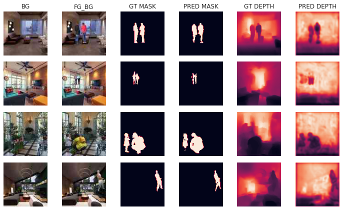
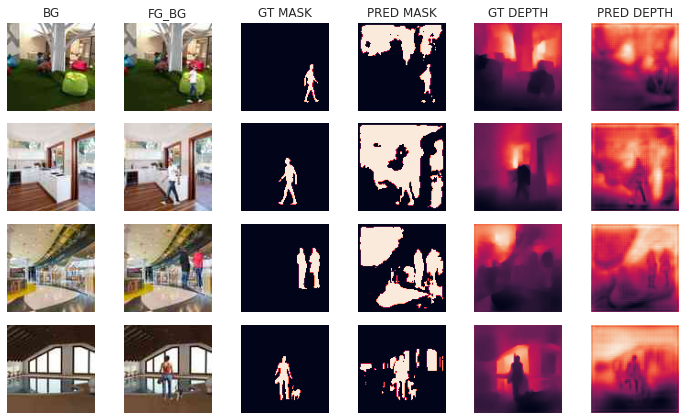
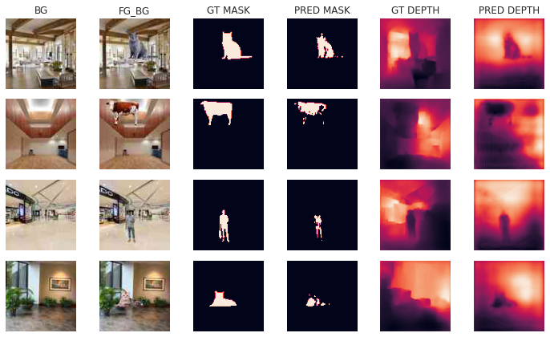
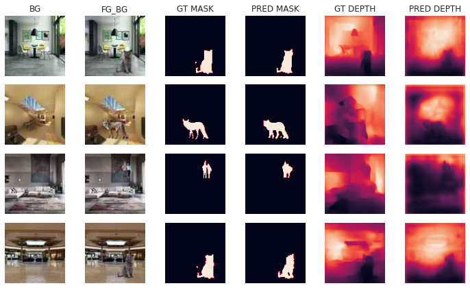
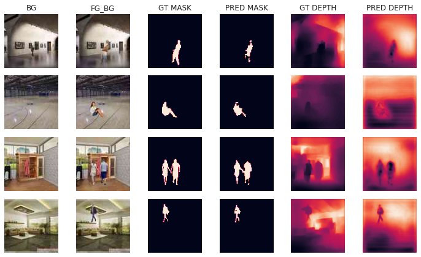

3. Loss Functions
=================

Segmentation Loss Functions:

- BCEWithLogits
- DiceLoss
- TverskyLoss

Depth Loss Functions:

- BerHu
- GradLoss
- BCEWithLogits

Various combinations of the above losses were tried with 1/16th of the dataset

A Small experiment was done to check if 30M params is really required or no, we found that
15M params model performed similar to 30M, so the higher param model was scraped

**With 30M Params:**

.. image:: assets/low-param.png

**With 15M Params:**

Playing with Loss Functions
***************************

.. csv-table:: Loss Functions Comparison
   :header: "Seg Loss Funcion", "Depth Loss Function", "mIOU", "mRMSE"
   :widths: 10, 10, 10, 10

   "BCE", "BCE", 0.1278, 0.1149
   "Dice", "BCE", 0.4515, 0.0858
   "Tversky", "BCE", 0.3221, 0.1018
   "BCEDice", "BCE", 0.4578, 0.0993
   "BCETversky", "BCE", 0.3831, 0.0936
   "BCEDice", "BerHu", 0.4214, 0.2882
   "BCEDice", "RMSE", 0.4366, 0.0774
   "BCEDice", "Grad", 0.4542, 0.1795
   "BCEDice", "SSIM", 0.4413, 0.1304

.. note::    
    - mIOU: higher is better
    - mRMSE: lower is better

**1. seg_loss = BCEWithLogits, depth_loss = BCEWithLogits**

    bce_bce 

    .. code-block:: none

        mIOU : 0.12789911031723022
        mRMSE : 0.11494194716215134
        total time : 196.1347 s

**2. seg_loss = DiceLoss, depth_loss = BCEWithLogits**

.. figure:: assets/loss_test/dice_bce.png

    dice_bce 

    .. code-block:: none

        mIOU : 0.4515075087547302
        mRMSE : 0.08582810312509537
        total time : 193.0364 s

**3. seg_loss = TverskyLoss, depth_loss = BCEWithLogits**

.. figure:: assets/loss_test/tversky_bce.png

    tversky_bce 

    .. code-block:: none

        mIOU : 0.32213953137397766
        mRMSE : 0.10182604193687439
        total time : 193.5620 s

**4. seg_loss = BCEDiceLoss, depth_loss = BCEWithLogits**

.. figure:: assets/loss_test/bcedice_bce.png

    bcedice_bce 

    .. code-block:: none

        mIOU : 0.4578476846218109
        mRMSE : 0.09939917922019958
        total time : 191.8000 s

**5. seg_loss = BCETverskyLoss, depth_loss = BCEWithLogits**

    bcetversky_bce 

    .. code-block:: none

        mIOU : 0.3831656873226166
        mRMSE : 0.0936645045876503
        total time : 192.6121 s

**6. seg_loss = BCEDiceLoss, depth_loss = BCEWithLogits**

    bcedice_bce 

    .. code-block:: none

        mIOU : 0.4485453963279724
        mRMSE : 0.12491746991872787
        total time : 193.3488 s

**7. seg_loss = BCEDiceLoss, depth_loss = BerHuLoss**

.. figure:: assets/loss_test/bcedice_berhu.png

    bcedice_berhu 

    .. code-block:: none

        mIOU : 0.42147812247276306
        mRMSE : 0.2882708013057709
        total time : 193.7522 s

**8. seg_loss = BCEDiceLoss, depth_loss = RMSELoss**

    bcedice_rmse

    .. code-block:: none

        mIOU : 0.4366089999675751
        mRMSE : 0.07745874673128128
        total time : 180.7616 s

**9. seg_loss = BCEDiceLoss, depth_loss = GradLoss**

.. figure:: assets/loss_test/bcedice_grad.png

    bcedice_grad

    .. code-block:: none

        mIOU : 0.4542521834373474
        mRMSE : 0.1795133352279663
        total time : 185.2947 s

**10. seg_loss = BCEDiceLoss, depth_loss = SSIMLoss**

.. figure:: assets/loss_test/bcedice_ssim.png

    bcedice_ssim

    .. code-block:: none

        mIOU : 0.4413087069988251
        mRMSE : 0.1304335743188858
        total time : 189.7473 s

