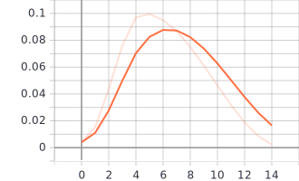
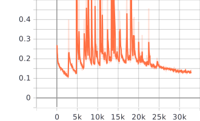
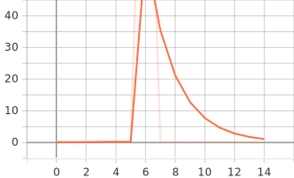
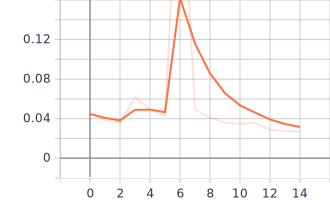
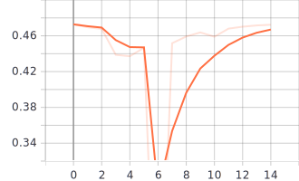
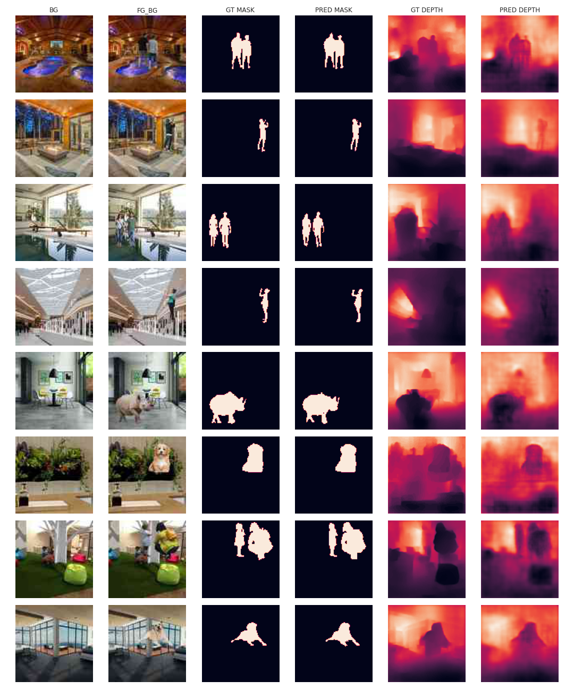

6. Training on Small Dataset
============================

Github Link : `<https://github.com/satyajitghana/ProjektDepth/blob/master/notebooks/13_DepthModel_TrainOnSmallDataset.ipynb>`_
Colab Link  : `<https://colab.research.google.com/github/satyajitghana/ProjektDepth/blob/master/notebooks/13_DepthModel_TrainOnSmallDataset.ipynb>`_

Now the model was trained on ``96x96`` images, so then later we can perform transfer learning to train on ``192x192`` images

The entire training took about 5.5 hrs, but its actually took more, since there were bugs that i had to patch up and then restart the run.

Albeit the program does checkpoint every epoch and also stores the best accuracy model, every model metric is logged using Tensorboard.

Quite a tiring experience overall 😪😪

LR Range Test
*************

GitHub Link : `<https://github.com/satyajitghana/ProjektDepth/blob/master/notebooks/12_DepthModel_LRRangeTest.ipynb>`_
Colab Link  : `<https://colab.research.google.com/github/satyajitghana/ProjektDepth/blob/master/notebooks/12_DepthModel_LRRangeTest.ipynb>`_

.. figure:: assets/lr-range-test.png

So the max_lr should be about ``0.2-0.4``

Colab was kept alive by using my chrome extension `<https://github.com/satyajitghana/colab-keepalive>`_

Train for 15 Epochs
*******************

**LR Value**
^^^^^^^^^^^^

**Train Loss**
^^^^^^^^^^^^^^

    Train - Segmentation Loss

.. figure:: assets/smalltrain/BatchLoss_Train_depth_loss.svg
    :width: 70%
    :align: center
    :figclass: align-center
    
    Train Depth Loss

**Train Accuracy**
^^^^^^^^^^^^^^^^^^

.. figure:: assets/smalltrain/EpochAccuracy_Train_mIOU.svg
    :width: 70%
    :align: center
    :figclass: align-center

    Train mIOU

.. figure:: assets/smalltrain/EpochAccuracy_Train_mRMSE.svg
    :width: 70%
    :align: center
    :figclass: align-center

    Train mRMSE

**Test Loss**
^^^^^^^^^^^^^

    
    Test - Segmentation Loss

    
    Test Depth Loss

**Test Accuracy**
^^^^^^^^^^^^^^^^^

    Test mIOU

.. figure:: assets/smalltrain/EpochAccuracy_Test_mRMSE.svg
    :width: 70%
    :align: center
    :figclass: align-center

    Test mRMSE

Results
*******

After first epoch
^^^^^^^^^^^^^^^^^

.. figure:: assets/smalltrain/step1.png

After 4th epoch
^^^^^^^^^^^^^^^

.. figure:: assets/smalltrain/step4.png

After 15th epoch
^^^^^^^^^^^^^^^^

